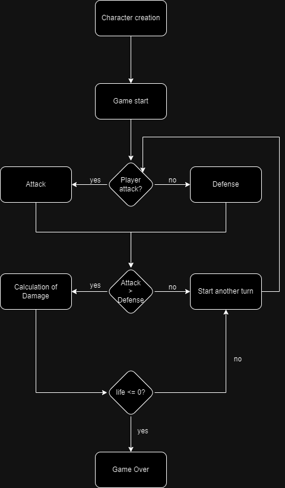

# Projeto RPG - API Rest com Java SpringBoot e Postgres

## Sumário

## Descrição do Jogo
Esse é um RPG de batalhas por turno. Nesse jogo, os jogadores podem escolher entre heróis e monstros, cada um com suas particularidade: o que faz necessário refletir bastante sobre qual tipo de personagem será escolhido!

O objetivo do jogo é, basicamente, reduzir os Pontos de Vida do oponente a zero, para, dessa forma, alcançar a vitória!

A dinâmica do jogo consiste em lançar dados para determinar o andamento do mesmo, desde a escolha do jogador que tomará a iniciativa, até o cálculo de ataque, defesa e dano.

Para jogar, você precisa interagir com os endpoints da aplicação, que serão explicados detalhadamente nesse documento.

## Informações sobre o jogo e suas regras

### Personagens disponíveis:

#### Heróis
| Personagem | Vida | Força | Defesa | Agilidade | Quantidade de Dados  | Faces do Dado |
|------------|------|-------|--------|-----------|----------------------|---------------|
| Guerreiro  | 20   | 7     | 5      | 6         | 1                    | 12            |
| Bárbaro    | 21   | 10    | 2      | 5         | 2                    | 8             |
| Cavaleiro  | 26   | 6     | 8      | 3         | 2                    | 6             |

#### Monstros
| Personagem | Vida | Força | Defesa | Agilidade | Quantidade de Dados  | Faces do Dado |
|------------|------|-------|--------|-----------|----------------------|---------------|
| Orc        | 42   | 7     | 1      | 2         | 3                    | 4             |
| Gigante    | 34   | 10    | 4      | 4         | 2                    | 6             |
| Lobisomen  | 34   | 7     | 4      | 7         | 2                    | 4             |

### Dados

Iniciativa: Para iniciar o jogo, os oponentes devem jogar um dado de 20 faces (1d20). 
Quem tirar a pedra maior, vence.  Isso é feito de forma randômica na aplicação. Não existe empate nessa etapa. Caso 
os competidores tirem o mesmo valor no dado, o cálculo é feito novamente, até que um competidor saia vitorioso.

Ataque: Para atacar, basta jogar um dado de 12 faces (1d12), e esse valor será somado à 
força e à agilidade do respectivo jogador.
<br>
Exemplo: suponhamos que o competidor da vez é um Orc, que, ao jogar o dado, conseguiu o valor 10. Somando esse 
valor com sua Força (7) e Agilidade (2), obtemos o valor total do ataque do Orc: 19.

Defesa: Para defender, também é jogado um dado de 12 faces (ad12), e o valor total da 
defesa é o valor tirado nos dados somado à defesa e à agilidade do jogador.
<br>
Exemplo: suponhamos que o defensor é um Warrior que jogou o dado e obteve o valor de 8. Somando com sua Defesa (5) e 
Agilidade (6), o jogador obteve 19 pontos de defesa.

Dano: Para calcular o dano, será utilizado a relação de dados que o personagem possui, somando o resultado com o 
valor de sua força.
<br>
Exemplo: O Werewolf tem como Quantidade de Dados o valor 2, e Faces do Dado o valor 4. Sendo assim, ao jogar os 
dados o Werewolf obterá um valor que oscilar de de 2 a 8. Suponhamos que o valor obtido seja 6, somando-o à sua 
Força (7), obtém-se o valor de 13, que é o total de dano que ele causará em seu oponente, caso tivesse o vencido na 
batalha de Ataque x Defesa.

Pontos de Vida: quando há o cálculo do dano, há também a diminuição do ponto de vida de quem sofreu o devido dano. 
Para o cálculo, basta diminuir o total de dano dos pontos de vida do jogador que efetivamente sofreu esse dano.

### Regras
- Para iniciar o jogo, é necessário escolher um personagem, em que pode ser herói ou monstro;
- O oponente deverá **sempre** ser um monstro, e não há a necessidade de escolhê-lo no jogo, pois ele pode ser 
  gerado aleatóriamente;
- O jogo termina assim que algum personagem ficar com seus Pontos de Vida iguais ou menores que zero.

## Fluxo do Jogo


## Como Jogar
Nesta seção será abordada o passo-a-passo do jogo. 

### Passo 1: Criação do Personagem
[Documentação sobre Characters](#characters)<br>

Primeiramente, você deve criar o seu personagem. E para isso, você precisa enviar uma requisição:
<br>
<b>URL: **http://localhost:8080/characters**
<br>
<b> Método: Post

[Requisito dos atributos do Json](#req-create-character) <br>
[Como deve ser o request](#request-create-character) <br>
[Possíveis retornos](#response-create-character)


### Passo 2: Início da partida
[Documentação sobre o Game](#start-game) <br>

<b>URL: **http://localhost:8080/game/start**
<br>
<b> Método: Post
<br>
[Requisito dos atributos do Json](#req-start-game)<br>
[Como deve ser o request](#request-start-game)<br>
[Possíveis retornos](#response-start-game)

### Passo 3: Atacar
[Documentação sobre o Ataque](#attack) <br>


<b>URL: **http://localhost:8080/game/attack**
<br>
<b> Método: Post

[Requisito dos atributos do Json](#req-attack)<br>
[Como deve ser o request](#request-attack)<br>
[Possíveis retornos](#response-attack)


### Passo 4: Defender
[Documentação sobre a Defesa](#defense) <br>
<b>URL: **http://localhost:8080/game/defense**
<br>
<b> Método: Post

[Requisito dos atributos do Json](#req-defense)<br>
[Como deve ser o request](#request-defense)<br>
[Possíveis retornos](#response-defense)


### Passo 5: se ataque bem sucedido, calcular o dano
[Documentação sobre o Dano](#damage) <br>
<b>URL: **http://localhost:8080/game/damage**
<br>
<b> Método: GET

[Request: no body](#request-damage)<br>
[Possíveis retornos](#response-damage)


### Passo 6: Se não houver encerrado o jogo com a vitória de algum jogador, iniciar um novo turno
Acontece a inversão dos papéis, e é enviada a requisição novamente. Ou seja, o personagem que atacou antes irá se 
defender nessa etapa. Enquanto quem se defendeu, abrirá o novo turno atacando.
<br>
Exemplo: Digamos que no início do jogo quem começou atacando foi o personagem de id 1, e quem se defendeu foi o 
personagem de id 2.
<br>
Para abrir o novo turno, será necessário enviar a requisição de ataca com o personagem cujo id é 2, e após 
finalizado o ataque, bastanta enviar a requisição para o endpoint de defesa com o personagem cujo id é 1. E assim 
sucessivamente...

### Passo 7: Histórico (Opcional)
[Documentação sobre o Histórico](#history) <br>
<b>URL: **http://localhost:8080/history**
<br>
<b> Método: GET

[Request: no body](#request-history)<br>
[Possíveis retornos](#response-history)


## Informações sobre o desenvolvimento

### Tecnologias:
- Java 17 com Spring Boot;
- PostgreSQL
- JUnit

### Executar o projeto:
- Necessário instalar as dependências evidências no arquivo pom.xml;
- Necessário ter o PostgresSQL instalado na máquina, com seu respectivo serviço rodando;
- Criar uma database e setar corretamente as informações de acesso no arquivo application.properties
- Após rodar a aplicação, a recomendação é utilizar o Insomnia ou o Postman para começar o jogo

### Endpoints
- Characters

  | Método HTTP | URL                                  | Descrição                                |
  |-------------|--------------------------------------|------------------------------------------|
  | `POST`      | http://localhost:8000/characters     | Criar novo personagem                    |
  | `PUT`       | http://localhost:8000/characters/{id} | Editar usuário pelo id                   |
  | `GET`       | http://localhost:8000/characters/{id} | Visualizar usuário pelo id               |
  | `DELETE`    | http://localhost:8000/characters/{id} | Deletar usuário pelo id                  |
  | `GET`       | http://localhost:8000/characters     | Visualizar todos os usuários cadastrados |

- Game

  | Método HTTP | URL                                | Descrição            |
  |-------------|------------------------------------|----------------------|
  | `POST`      | http://localhost:8000/game/start   | Começar um novo jogo |
  | `POST`      | http://localhost:8000/game/attack  | Atacar               |
  | `POST`      | http://localhost:8000/game/defense | Defender             |
  | `GET`       | http://localhost:8000/game/damage  | Cálcular dano        |

- History
        
    | Método HTTP | URL                                | Descrição                         |
    |-------------|------------------------------------|-----------------------------------|
    | `GET`       | http://localhost:8000/history      | Visualizar o histórico dos jogos  |
- | `GET`       | http://localhost:8000/history/{id} | Visualizar o histórico de um jogo |

### Requisições e Respotas
<a id="characters"></a>
- Characters 

`POST`: Criar um personagem
<br>
`URL`: http://localhost:8080/characters

<a id="req-create-character"></a>

| Atributo       | Tipo   | Obrigatório | Descrição | Valores aceitos                                                       |
  |----------------|--------|-------------|---------|-----------------------------------------------------------------------|
| name           | String | Sim         | Nome do personagem | Qualquer String                                                       |
| type           | Enum   | Sim         | Tipo do Personagem | hero, monster                                                         |
| characterClass | Enum   | Sim         | Classe do Personagem | Se HERO: warrior, barbarian, knight. Se MONSTER: orc, giant, werewolf |

**Request**
<br>

<a id="request-create-character"></a>

```json
{
  "name":"Angela",
  "type":"hero",
  "characterClass":"warrior"
}
```
**Response**
<br>

<a id="response-create-character"></a>

`Status 201`
```json
{
	"id": 52,
	"name": "Angela",
	"type": "HERO",
	"characterClass": "WARRIOR",
	"health": 20,
	"strength": 7,
	"defense": 5,
	"agility": 6,
	"diceQuantity": 1,
	"diceFaces": 12
}
```


`Status 404`
<br>

Se não houver o tipo de personagem solicitado
````json
{
	"timestamp": "2023-09-14T13:20:58Z",
	"status": 404,
	"error": "There is no character with the described type.",
	"message": "type",
	"path": "/characters"
}
````
<br>
Se não houver a classe de personagem solicitado

````json
{
  "timestamp": "2023-09-14T13:22:42Z",
  "status": 404,
  "error": "There is no character with the described class.",
  "message": "This monster doesn't exists.",
  "path": "/characters"
}
````

`PUT`: Editar um personagem
<br>
`URL`: http://localhost:8080/characters/{id}

| Atributo       | Tipo   | Obrigatório | Descrição | Valores aceitos                                                       |
  |----------------|--------|-------------|---------|-----------------------------------------------------------------------|
| name           | String | ???         | Nome do personagem | Qualquer String                                                       |
Request

````json
{
  "name":"Angela Hempkmeier"
}
````
Caso haja a tentativa de editar outros campos, esses campos serão ignorados.
<br>
Response
`Status 200`

````json
{
	"id": 1,
	"name": "Angela Hempkmeier",
	"type": "MONSTER",
	"characterClass": "ORC",
	"health": 42,
	"strength": 7,
	"defense": 1,
	"agility": 2,
	"diceQuantity": 3,
	"diceFaces": 4
}
````
`Status 404`

````json
{
  "timestamp": "2023-09-14T13:49:15Z",
  "status": 404,
  "error": "Character not found",
  "message": "Character not found. Id: 20789",
  "path": "/characters/20789"
}
````

`GET`: Visualizar um personagem
<br>
`URL`: http://localhost:8080/characters/{id}

Request

``No body``

<br>
Response
`Status 200`

````json
{
  "id": 202,
  "name": "Angela",
  "type": "HERO",
  "characterClass": "WARRIOR",
  "health": 20,
  "strength": 7,
  "defense": 5,
  "agility": 6,
  "diceQuantity": 1,
  "diceFaces": 12
}
````
`Status 404`

````json
{
  "timestamp": "2023-09-14T13:53:56Z",
  "status": 404,
  "error": "Character not found",
  "message": "Character not found. Id: 208979",
  "path": "/characters/208979"
}
````

`DELETE`: Deletar um personagem
<br>
`URL`: http://localhost:8080/characters/{id}

Request

``No body``

<br>
Response

`Status 204`

`No body returned for response`

`Status 404`

````json
{
  "timestamp": "2023-09-14T13:56:39Z",
  "status": 404,
  "error": "Character not found",
  "message": "Character not found. Id: 13",
  "path": "/characters/13"
}
````


`GET`: Visualizar todos os personagens
<br>
`URL`: http://localhost:8080/characters

Request

``No body``

<br>
Response

`Status 200`

````json
[
	{
		"id": 1,
		"name": "Angela",
		"type": "MONSTER",
		"characterClass": "ORC",
		"health": 42,
		"strength": 7,
		"defense": 1,
		"agility": 2,
		"diceQuantity": 3,
		"diceFaces": 4
	},
	{
		"id": 2,
		"name": "Jubs",
		"type": "HERO",
		"characterClass": "WARRIOR",
		"health": 20,
		"strength": 7,
		"defense": 5,
		"agility": 6,
		"diceQuantity": 1,
		"diceFaces": 12
	},
	{
		"id": 52,
		"name": "Angela",
		"type": "HERO",
		"characterClass": "WARRIOR",
		"health": 20,
		"strength": 7,
		"defense": 5,
		"agility": 6,
		"diceQuantity": 1,
		"diceFaces": 12
	}
]
````

<a id="start-game"></a>

- Game

`POST`: Iniciar o jogo
<br>
`URL`: http://localhost:8080/game/start

<a id="req-start-game"></a>

| Atributo       | Tipo | Obrigatório | Descrição            |
  |----------------|------|-------------|----------------------|
| player         | Long | ?????       | Id do player         |
| opponent       | Long | Não         | Id do opponent       | 

**Request**
<br>

É possível escolher o player e o opponent, ou apenas o player.

<a id="request-start-game"></a>

```json
{
  "player":1,
  "opponent":2
}	
```
Criar um request apenas com o player faz a aplicação gerar automaticamente o _opponent_ (MONSTER).

```json
{
  "player":1
}	
```

**Response**
<br>

<a id="response-start-game"></a>

`Status 201`
```json
{
  "Attacker": "Angela",
  "Attacker id": "1",
  "Attacker roll dice": 19,
  "Defender": "Lord Voldemort",
  "Defender id": "252",
  "Defender roll dice": 17,
  "Next step:": "Send attack requisition using attacker id."
}
```
A resposta acima é um exemplo de quando se é enviado apenas o player na requisição.

`Status 404`
<br>

````json
{
  "timestamp": "2023-09-14T14:12:01Z",
  "status": 404,
  "error": "Character not found",
  "message": "Character not found. Id: 24098573908503",
  "path": "/game/start"
}
````
`Status 400`

Caso o seu oponente não seja um MONSTER

````json
{
  "timestamp": "2023-09-14T14:15:22Z",
  "status": 400,
  "error": "The opponent has to be a monster",
  "message": "Opponent has to be a monster.",
  "path": "/game/start"
}
````

Caso um jogador tente jogar contra si próprio

````json
{
  "timestamp": "2023-09-14T15:53:38Z",
  "status": 400,
  "error": "Oops! It seems like you are trying to play against yourself.",
  "message": null,
  "path": "/game/start"
}
````

<a id="attack"></a>

`POST`: Atacar
<br>
`URL`: http://localhost:8080/game/attack

<a id="req-attack"></a>

| Atributo | Tipo | Obrigatório | Descrição      |
  |----------|------|-------------|----------------|
| id       | Long | ?????       | Id do atacante |

**Request**
<br>

<a id="request-attack"></a>

```json
{
  "id":1
}	
```

**Response**
<br>

<a id="response-attack"></a>

`Status 200`
```json
{
  "Attacker hit with a damage of": 16,
  "Now it's time for the defender to try to defend itself!": "Go, Darth Vader!",
  "Send a request with the defender's id:": 2
}
```
Caso seja enviado o request para atacar com o usuário indevido

`Status 400`
```json
{
  "timestamp": "2023-09-14T16:31:46Z",
  "status": 400,
  "error": "Oops! It seems like you're trying to attack, but it's not your turn.",
  "message": "Attack with id: 1",
  "path": "/game/attack"
}
```

Caso tente ser feito um ataque sem o jogo ter começado

````json
{
	"timestamp": "2023-09-14T14:19:14Z",
	"status": 400,
	"error": "Game not started yet",
	"message": "The game hasn't started yet. You cannot attack.",
	"path": "/game/attack"
}
````

Caso o turno não tenha começado ainda
````json
{
  "timestamp": "2023-09-14T15:04:40Z",
  "status": 400,
  "error": "Oops! It seems like the turn doesn't started yet.",
  "message": "First, the turn must be started, and it occurs immediately after the game starts. Please start the game before attacking.",
  "path": "/game/attack"
}
````

<a id="defense"></a>

`POST`: Defense
<br>
`URL`: http://localhost:8080/game/defense

<a id="req-defense"></a>

| Atributo | Tipo | Obrigatório | Descrição      |
  |----------|------|-------------|----------------|
| id       | Long | ?????       | Id do defensor |

**Request**
<br>

<a id="request-defense"></a>

```json
{
  "id":2
}	
```

**Response**
<br>

<a id="response-defense"></a>

`Status 200`

Se o ataque for maior que a defesa:
```json
{
  "The defender defended itself with:": 14,
  "Attacker wins!": " The attacker struck with more power than the defender could defend against.",
  "Attacker x Defender:": "16 > 14",
  "Next step: ": "calculate the damage."
}
```
Se a defesa for maior que o ataque:
````json
{
	"The defender defended itself with:": 20,
	"Defender wins!": " The defender managed to fend off the attack.",
	"Attacker x Defender:": "17 < 20",
	"Next step: ": "start another turn."
}
````

`Status 400`
```json
{
  "timestamp": "2023-09-14T16:33:03Z",
  "status": 400,
  "error": "Oops! It seems like you're trying to defense, but it's not your turn.",
  "message": "Defense with id: 2",
  "path": "/game/defense"
}
```

`Status 404`
```json
{
  "timestamp": "2023-09-14T16:51:35Z",
  "status": 404,
  "error": "Character not found",
  "message": "Character not found. Id: 4",
  "path": "/game/defense"
}
```
<a id="damage"></a>

`GET`: Damage
<br>
`URL`: http://localhost:8080/game/damage

**Request**
<br>

<a id="request-damage"></a>

`No body`

**Response**
<br>

<a id="response-damage"></a>

`Status 200`

```json
{
  "Damage done by": "Angela",
  "Damage received by": "Lord Voldemort",
  "Value of damage was": 8,
  "Life of Lord Voldemort is now": 26,
  "Game status": "All aboard for the next turn!"
}
```
Em caso de um jogador ficar com seus Pontos de Vida igual ou menor que zero

````json
{
	"Damage done by": "Lord Voldemort",
	"Damage received by": "Angela",
	"Value of damage was": 14,
	"Life of Angela is now": -7,
	"Game over": "Lord Voldemort won!"
}
````

`Status 403`

Caso haja a tentativa de calcular o dano sem a partida estar iniciada e as fases de ataque e defesa finalizadas.

```json
{
  "timestamp": "2023-09-14T17:02:41Z",
  "status": 403,
  "error": "Damage not allowed!",
  "message": "To calculate the damage, the game must have been started, and both players must have completed the attack and defense phases.",
  "path": "/game/damage"
}
```

<a id="history"></a>

- History

`GET`: History
<br>
`URL`: http://localhost:8080/history

**Request**
<br>
<a id="request-history"></a>

`No body`

**Response**
<br>

<a id="response-history"></a>

`Status 200`

```json
[
  {
    "historyId": 1,
    "game": {
      "gameId": 2,
      "player": {
        "id": 1,
        "name": "ANGLI",
        "type": "HERO",
        "characterClass": "KNIGHT"
      },
      "opponent": {
        "id": 3,
        "name": "Hannibal Lecter",
        "type": "MONSTER",
        "characterClass": "GIANT"
      },
      "playerInitiated": false
    },
    "turnBattles": [
      {
        "turn": 2,
        "attacker": "ANGLI",
        "attack": 13,
        "defender": "Hannibal Lecter",
        "defense": 13,
        "damage": null
      },
      {
        "turn": 4,
        "attacker": "ANGLI",
        "attack": 20,
        "defender": "Hannibal Lecter",
        "defense": 11,
        "damage": 10
      },
      {
        "turn": 1,
        "attacker": "Hannibal Lecter",
        "attack": 16,
        "defender": "ANGLI",
        "defense": 19,
        "damage": null
      },
      {
        "turn": 3,
        "attacker": "Hannibal Lecter",
        "attack": 25,
        "defender": "ANGLI",
        "defense": 21,
        "damage": 19
      },
      {
        "turn": 5,
        "attacker": "Hannibal Lecter",
        "attack": 25,
        "defender": "ANGLI",
        "defense": 15,
        "damage": 19
      }
    ],
    "winner": "Hannibal Lecter"
  },
  {
    "historyId": 2,
    "game": {
      "gameId": 3,
      "player": {
        "id": 1,
        "name": "ANGLI",
        "type": "HERO",
        "characterClass": "KNIGHT"
      },
      "opponent": {
        "id": 4,
        "name": "Dolores Umbridge",
        "type": "MONSTER",
        "characterClass": "ORC"
      },
      "playerInitiated": true
    },
    "turnBattles": [
      {
        "turn": 1,
        "attacker": "ANGLI",
        "attack": 11,
        "defender": "Dolores Umbridge",
        "defense": 15,
        "damage": null
      },
      {
        "turn": 3,
        "attacker": "ANGLI",
        "attack": 11,
        "defender": "Dolores Umbridge",
        "defense": 13,
        "damage": null
      },
      {
        "turn": 5,
        "attacker": "ANGLI",
        "attack": 14,
        "defender": "Dolores Umbridge",
        "defense": 14,
        "damage": null
      },
      {
        "turn": 7,
        "attacker": "ANGLI",
        "attack": 17,
        "defender": "Dolores Umbridge",
        "defense": 8,
        "damage": 12
      },
      {
        "turn": 9,
        "attacker": "ANGLI",
        "attack": 11,
        "defender": "Dolores Umbridge",
        "defense": 6,
        "damage": 12
      },
      {
        "turn": 2,
        "attacker": "Dolores Umbridge",
        "attack": 12,
        "defender": "ANGLI",
        "defense": 16,
        "damage": null
      },
      {
        "turn": 4,
        "attacker": "Dolores Umbridge",
        "attack": 18,
        "defender": "ANGLI",
        "defense": 20,
        "damage": null
      },
      {
        "turn": 6,
        "attacker": "Dolores Umbridge",
        "attack": 16,
        "defender": "ANGLI",
        "defense": 21,
        "damage": null
      },
      {
        "turn": 8,
        "attacker": "Dolores Umbridge",
        "attack": 18,
        "defender": "ANGLI",
        "defense": 17,
        "damage": 12
      },
      {
        "turn": 10,
        "attacker": "Dolores Umbridge",
        "attack": 21,
        "defender": "ANGLI",
        "defense": 17,
        "damage": 17
      }
    ],
    "winner": "Dolores Umbridge"
  }
]
```

`GET`: History
<br>
`URL`: http://localhost:8080/history/id

**Request**
<br>

`No body`

**Response**
<br>

`Status 200`

```json
{
  "historyId": 2,
  "game": {
    "gameId": 53,
    "player": {
      "id": 52,
      "name": "Monstrinho",
      "type": "MONSTER",
      "characterClass": "ORC"
    },
    "opponent": {
      "id": 54,
      "name": "Goblin",
      "type": "MONSTER",
      "characterClass": "GIANT"
    },
    "playerInitiated": true
  },
  "turnBattles": [
    {
      "turn": 1,
      "attacker": "Monstrinho",
      "attack": 14,
      "defender": "Goblin",
      "defense": 9,
      "damage": 13
    },
    {
      "turn": 2,
      "attacker": "Goblin",
      "attack": 24,
      "defender": "Monstrinho",
      "defense": 7,
      "damage": 16
    },
    {
      "turn": 3,
      "attacker": "Monstrinho",
      "attack": 12,
      "defender": "Goblin",
      "defense": 17,
      "damage": null
    },
    {
      "turn": 4,
      "attacker": "Goblin",
      "attack": 15,
      "defender": "Monstrinho",
      "defense": 13,
      "damage": 16
    },
    {
      "turn": 5,
      "attacker": "Monstrinho",
      "attack": 11,
      "defender": "Goblin",
      "defense": 18,
      "damage": null
    },
    {
      "turn": 6,
      "attacker": "Goblin",
      "attack": 23,
      "defender": "Monstrinho",
      "defense": 14,
      "damage": 15
    }
  ],
  "winner": "Goblin"
}
```

### Próximos Passos
- Implementação da desistência do jogo, assim o vencedor ganha por WO
- Possibilidade da retomada de um jogo que não foi finalizado
- Continuação da implementação de testes
- Melhoria no código
- Refatoração de alguns métodos nas camadas de service